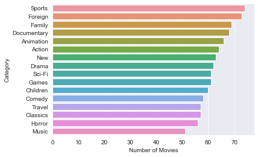

# DVD-Rental-Business-Insights-with-SQL

We will create Insigths with SQL Queries within the Jupyter Notebook.

 
 
# The Data

I will use the DVD-Rental Sample Database from postgres tutorial.  
The installation process is described at the [Postgres Site](https://www.postgresqltutorial.com/load-postgresql-sample-database/).

[Here](Documents/printable-postgresql-sample-database-diagram.pdf) you can download the Entity Relationship Diagram.

 
 
# Database Connection

I have installed the Sample DB on my laptop. 
This are my connections informations:

DB-IP/Port : 192.168.0.101:5432  
DB-Username: postgres  
DB-Password: postgres 
DB-Name:     DVD-Rental
 
 
# Business Questions

1. Identify the top 10 Customers by Amount and their Emails so we can reward them.
2. How many rentals and Payments did the Top 10 Customers made for each month during 2007?
3. Identify the bottom 10 Customers and their Emails!
4. What are the most profitable Movie by Genres?
5. What are the most profitable Movie by Ratings?
6. How many rented Movies were returned late, early, and on time?
7. What is the customer base in the Countries where we have a presence?
8. Which Country is the most profitable for the business?!
9. What is the average rental rate per Movie Genre (Rating)?
10. Which Actor is the most popular in each Country based on Amount?